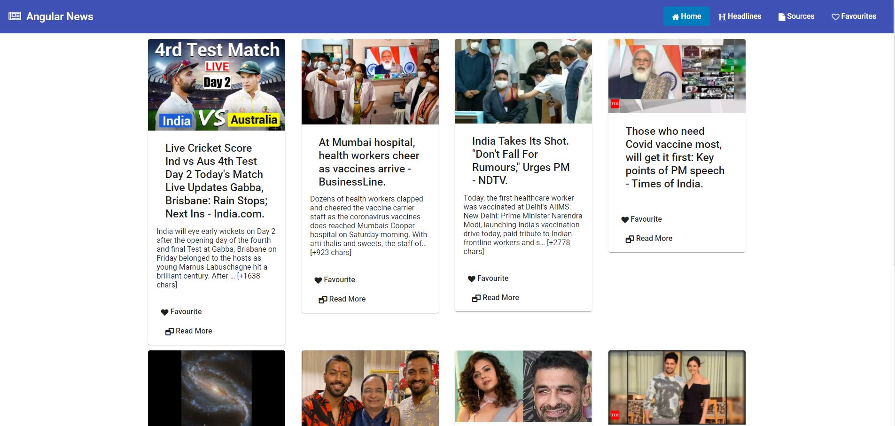
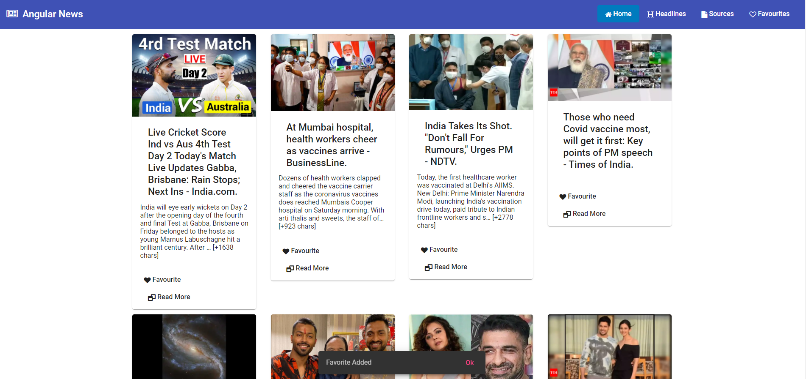
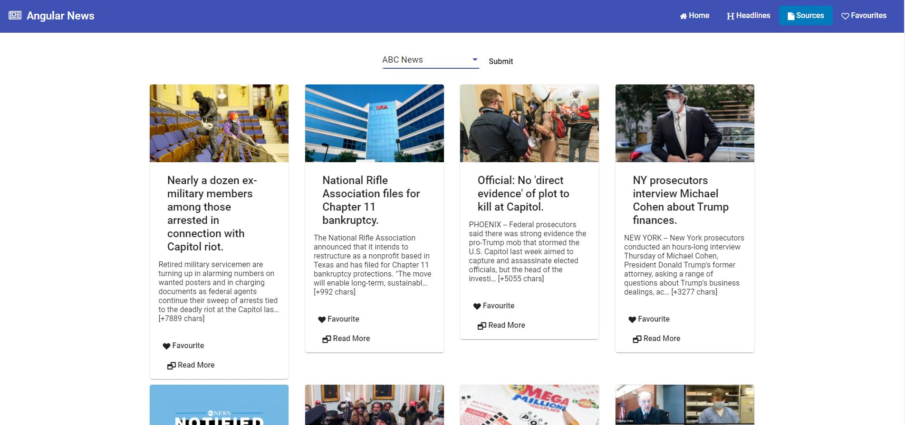
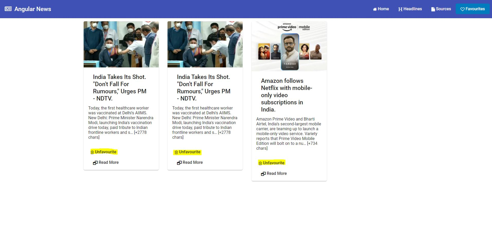

<h1 align="center">Welcome to Angular News 👋</h1>
<p>
  
  <a href="https://twitter.com/alok722" target="_blank">
    
  </a>
  <a href="https://github.com/alok722" target="_blank">
                                           
  </a>       
</p>

> A responsive news web app coded with Angular and angular material consuming https://newsapi.org/ API

## 🛠 usage

```shell
$ cd angular-news
$ npm install
$ ng serve
$ open `http://localhost:4200/`
```

## 📸 screenshot






## Author

👤 **Alok Raj**

* Website: https://opendevs.in
* Twitter: [@AlokR1](https://twitter.com/alok722)
* Github: [@alok722](https://github.com/alok722)
* LinkedIn: [@alok722](https://linkedin.com/in/alok722)

## 🤝 Contributing

Contributions, issues and feature requests are welcome!<br />Feel free to check [issues page](https://github.com/alok722/angular-news/issues). 

## Show your support

Give a ⭐️ if this project helped you!

***
_This README was generated with ❤️ by [readme-md-generator](https://github.com/kefranabg/readme-md-generator)_
